# Architecture

This document is a deep technical tour of how `mcp-memory-server` actually
works end to end. If the README tells you *what* the server does, this one
tells you *how*: which processes talk to which, where the data physically
lives, what each tool does under the hood, and why certain design choices
were made.

The server has been built around a single goal: give an LLM agent a durable,
structured, queryable memory that survives across sessions without ever
asking the LLM to be the arbiter of truth. Every merge, every contradiction
detection, every staleness check is deterministic Python + Cypher. The LLM
is a client, not an oracle.

## Table of contents

1. [System topology](#1-system-topology)
2. [The two storage layers](#2-the-two-storage-layers)
3. [Embeddings and the shared model cache](#3-embeddings-and-the-shared-model-cache)
4. [Writing a memory: the dedup path](#4-writing-a-memory-the-dedup-path)
5. [Writing an entity: typed labels and placeholder promotion](#5-writing-an-entity-typed-labels-and-placeholder-promotion)
6. [Writing a relationship: classification, auto-create, confirmation](#6-writing-a-relationship-classification-auto-create-confirmation)
7. [Hybrid retrieval: vector + BM25 fused via RRF](#7-hybrid-retrieval-vector--bm25-fused-via-rrf)
8. [Reranking with a cross-encoder](#8-reranking-with-a-cross-encoder)
9. [Claims, auto-contradiction detection, and temporal validity](#9-claims-auto-contradiction-detection-and-temporal-validity)
10. [Mental models: cached answers with deterministic staleness](#10-mental-models-cached-answers-with-deterministic-staleness)
11. [Communities: lightweight graph summarization](#11-communities-lightweight-graph-summarization)
12. [Confidence decay and pruning](#12-confidence-decay-and-pruning)
13. [The `knowledge_check` fast probe](#13-the-knowledge_check-fast-probe)
14. [Observability: the merge-audit log](#14-observability-the-merge-audit-log)
15. [Fail-soft design](#15-fail-soft-design)

---

## 1. System topology

At the coarsest level there are only three moving parts: an MCP client (your
agent), the Python server process, and a Neo4j database. The Python process
is the only thing that knows anything about embeddings, reranking, or
Cypher — the client speaks MCP and the database speaks Bolt.

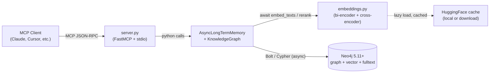

`server.py` is a thin shim. Each MCP tool is a function that validates its
inputs, dispatches to the matching `AsyncLongTermMemory` or `KnowledgeGraph`
method, and shapes the response back into the agreed-upon JSON schema. All
of the actual logic — dedup, classification, fusion, staleness detection —
lives inside `tools/long_term_memory.py`, which is a single ~5900 line
module split into two cooperating classes.

`AsyncLongTermMemory` owns the flat memory store and the Neo4j driver. It
exposes `store`, `recall`, `find_similar`, `knowledge_check`, and friends.
`KnowledgeGraph` is instantiated with a reference back to its parent LTM
and reuses the same driver — this is why the two layers can be read in a
single `knowledge_check` call without opening a second connection.

Embeddings and reranking live in `tools/embeddings.py`. A single bi-encoder
model (default: `all-MiniLM-L6-v2`, 384 dims) is loaded lazily on first use
and cached for the lifetime of the process. The cross-encoder
(`cross-encoder/ms-marco-MiniLM-L-6-v2`, ~90MB) is loaded only when
reranking is actually requested. Both models run under a `ThreadPoolExecutor`
so the asyncio loop in the server is never blocked by a synchronous
`encode()` call.

---

## 2. The two storage layers

The server deliberately runs two different data models side by side in the
same Neo4j database. They are not alternatives — they are complements, and
most queries end up touching both.

**The flat layer** is a single `:Memory` node label. Each node is a
free-text blob with a category, importance score, tag list, embedding, and
access-count telemetry. There is one vector index over `Memory.embedding`
and one full-text index over `Memory.content`. This layer exists because
sometimes you just want to write "the user prefers tabs" and recall it
later without first inventing an ontology.

**The graph layer** is a set of typed entity labels (`Person`,
`Organization`, `Technology`, `Concept`, `Event`, `Location`, `Metric`),
plus `Claim`, `Document`, `MentalModel`, and `Community` nodes, wired
together with a controlled vocabulary of typed relationships. Every typed
entity label has its own vector index and its own full-text index, so a
query for a `Person` doesn't have to scan embeddings for every `Metric` in
the database.

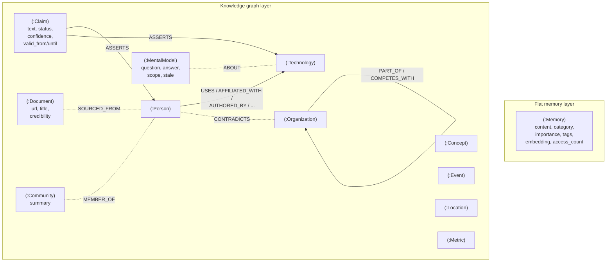

Why the split? Two reasons. First, insertion cost: upserting an entity with
dedup requires an embedding + a vector search + possibly a type-upgrade
rewrite. That's fine when the information is worth it, but overkill for a
one-line observation. The flat layer is intentionally cheap. Second,
retrieval shape: for "what do I know about X?" questions you want both the
structural graph context *and* the raw notes that never got promoted to
entities. `recall_graph_context` queries both layers in one pass and
returns a merged, formatted text block.

Schema creation is idempotent and happens in `_create_schema` during
`async_init`. Every `CREATE CONSTRAINT` and `CREATE … INDEX IF NOT EXISTS`
is safe to re-run on an already-populated database, which means the server
can be restarted at any time without migration ceremony.

---

## 3. Embeddings and the shared model cache

`tools/embeddings.py` is a small module with an outsized impact on
latency and memory usage. It owns two things: a lazily-loaded SentenceTransformer
bi-encoder and a lazily-loaded CrossEncoder reranker, both wrapped behind
`async def` entry points that offload the actual `encode()` or `predict()`
call to a bounded `ThreadPoolExecutor`.

The threadpool matters. SentenceTransformer's `encode()` is a synchronous
Torch call that will happily hold a CPU core for 50–200ms on a batch. If
the server called it directly from an `async def` handler, the entire
event loop would stall and other MCP tool calls would queue behind it.
By wrapping the call in `loop.run_in_executor(_executor, ...)` with
`_MAX_WORKERS=4` (configurable via `MAX_EMBEDDING_WORKERS`), the server
can embed concurrently up to the pool size while every other handler
keeps progressing.

Model loading is also lazy and cached per-process. The first call to
`embed_texts` triggers a `SentenceTransformer(model_name)` that resolves
the weights from the local HuggingFace cache if available, otherwise
downloads them. Subsequent calls hit the `_model_cache` dict and skip
loading entirely. The cross-encoder follows the same pattern but under a
separate cache entry, so a server that never reranks never pays the ~90MB
model-load cost.

Setting `EMBEDDINGS_ENABLED=false` short-circuits every embedding call to
return an empty list. The rest of the system is designed to tolerate this:
`store` will write a `:Memory` node without an embedding, `recall` will
fall back to full-text-only search, and dedup checks simply skip the
vector probe. This is the memory-constrained host escape hatch.

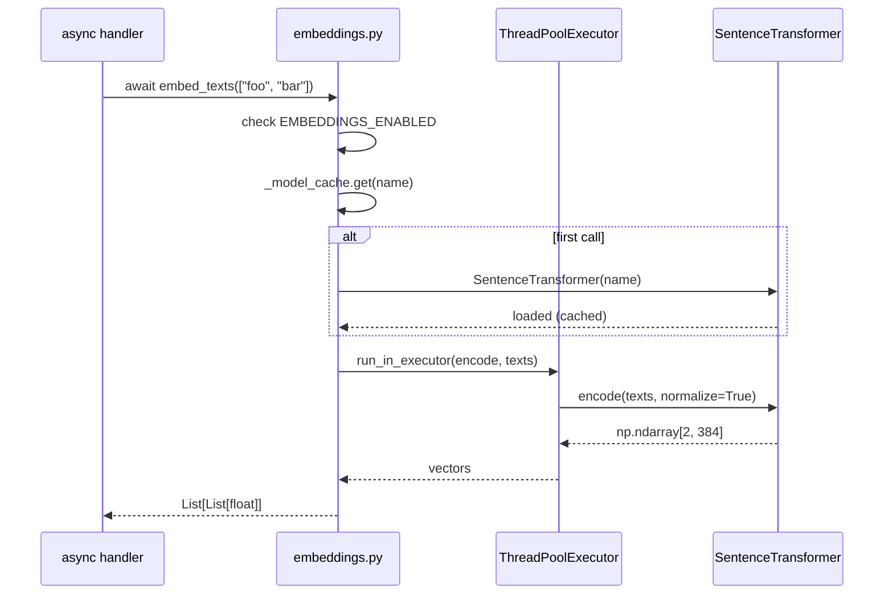

A design note on normalization: all embeddings are L2-normalized at
encode time. This means cosine similarity reduces to a dot product, which
is what Neo4j's `vector.similarity_function: 'cosine'` option assumes.
Mixing normalized and un-normalized vectors in the same index silently
breaks ranking, so the embedding helpers are the single enforcement point.

---

## 4. Writing a memory: the dedup path

`memory_store` is where most agents will first touch the system. On the
surface it looks like a simple `CREATE (m:Memory)`, but there are three
distinct phases before the node actually lands.

First, the content is embedded. If embeddings are disabled or the model
load fails, the vector stays `None` and the dedup step is skipped — this
is the "cheap mode" fallback and it is still correct, just less
intelligent.

Second, if a vector exists, the store runs a one-shot vector probe against
`memory_embedding_idx` asking for the single nearest neighbor with cosine
similarity ≥ `_DEDUP_THRESHOLD` (0.95). That threshold is deliberately
high: at 0.95 cosine on a MiniLM embedding, the two texts are
near-paraphrases, not merely topically related. If a neighbor comes back,
the server treats the write as a *confirmation* of the existing memory
rather than a new fact. It bumps the existing node's `last_accessed` and
`access_count`, emits a `[MERGE]` audit line, and returns
`{"success": True, "merged": True, "memory_id": <existing>, "similarity": …}`.
The caller sees a successful write and a stable id to reference going
forward.

Third, if no duplicate is found, a fresh `:Memory` node is created with a
newly-minted UUID, the embedding, the normalized tag list (serialized as
JSON because Neo4j array properties are homogeneous and tag payloads
sometimes aren't), and any `extra_metadata` keys prefixed with `custom_`
to avoid colliding with first-class memory fields.

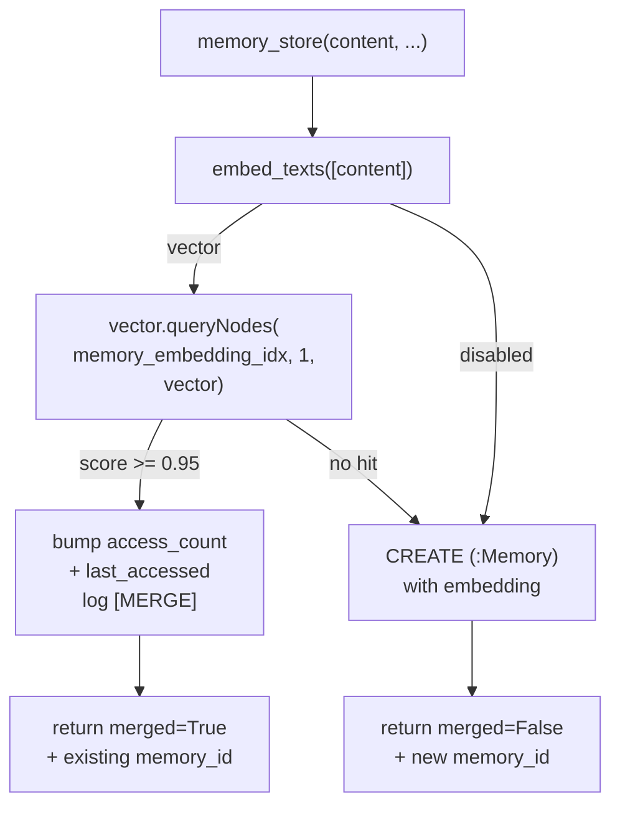

The `merged=True` convention is important: it is `success=True`, not an
error. This matches the entity and relationship upsert paths and lets an
agent treat "we already know this" as a normal, expected outcome instead
of a failure to handle. The agent can continue to reference the returned
id as if it had just created the node.

---

## 5. Writing an entity: typed labels and placeholder promotion

`graph_upsert_entity` is more involved than `memory_store` because entities
have *types* and types carry semantics. The server supports seven typed
labels — Person, Organization, Technology, Concept, Event, Location,
Metric — each with its own vector index. The caller supplies an
`entity_type` string, which `resolve_entity_label` maps to a canonical
Neo4j label (unknown types fall back to `Concept` and the response
carries a `warning` so the caller knows their hint was lost).

Dedup is where it gets interesting. An agent might upsert "FastAPI" as a
`Technology` and later re-upsert "FastAPI" as a `Concept` because it
forgot. The server doesn't want two nodes. It also doesn't want to lose
the more specific type. So dedup runs across *all* typed indexes via a
`UNION ALL` query, built dynamically by `_build_union_vector_search`, and
asks for the single best match above `_ENTITY_DEDUP_THRESHOLD` (0.92 —
slightly looser than the memory threshold because entity names are
shorter and the embedding has less text to disambiguate).

If a match comes back, the server compares the proposed type's
specificity against the existing node's type via `_TYPE_SPECIFICITY`:

```
Person(7) > Organization(6) > Technology(5)
         > Event(4) > Location(3) > Metric(2) > Concept(1)
```

When the new type is strictly more specific and different from the
existing one, the server performs a *type upgrade*: it issues a
`REMOVE e:<old_label> SET e:<new_label>` in the same transaction as the
property merge. The entity keeps its id, its edges, and its history —
only its label changes. This is why upserting "Jay" as `Person` after
having stored it as `Concept` cleanly promotes it instead of creating a
duplicate.

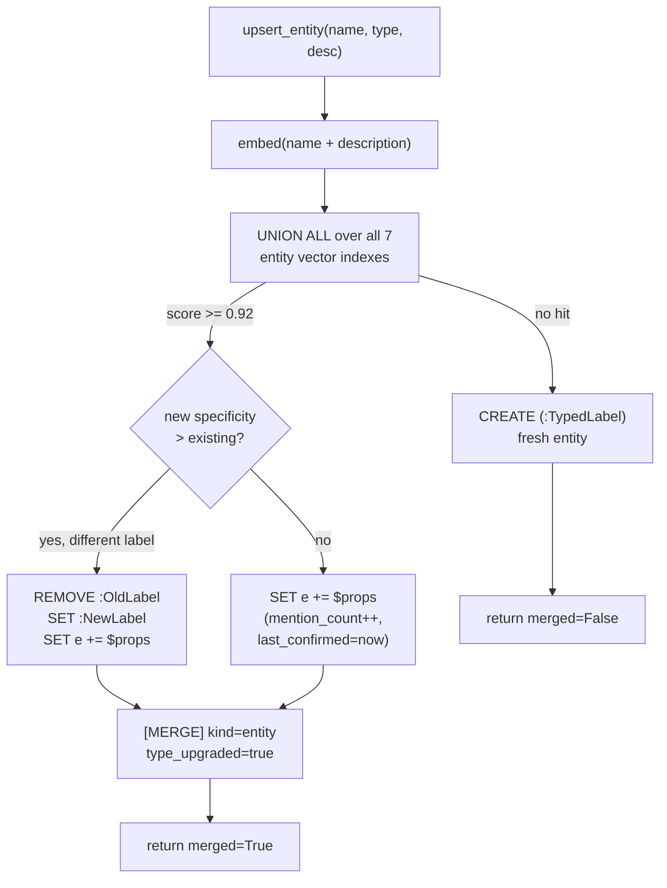

Then there's the **placeholder promotion** mechanic. When
`store_relationship` or `store_contradiction` or `store_claim` encounters
an endpoint entity that doesn't exist yet, it auto-creates it with
`is_placeholder=True`. This is defensive: a `MATCH (s)-[]->(t) CREATE …`
Cypher pattern silently no-ops if either endpoint is missing, which would
mean the edge is lost but the method still reports success. By
materializing missing endpoints as placeholders, no edge is ever dropped.

But placeholders are not real knowledge. The pruner's two-tier sweep
treats them harshly: placeholder orphans get deleted on sight, while real
orphans are only swept after `max_age_days`. The *promotion* happens
inside `upsert_entity`: when an entity dedup hits an existing placeholder
and the caller is explicitly providing content (any upsert that doesn't
itself set `is_placeholder=True`), the flag is cleared. The entity
transitions from "spawned to save an edge from a typo" to "deliberately
known" without the caller needing to think about it.

---

## 6. Writing a relationship: classification, auto-create, confirmation

Relationships in Neo4j are first-class citizens — they have labels,
properties, and direction — but they must be created from a `MATCH` of two
existing endpoints. That constraint shapes `graph_store_relationship`.

The method takes a free-form `relation` string ("uses", "depends on",
"authored by") and either accepts an explicit `relationship_label` or
classifies the string via `classify_relation`. The classifier is a
regex table (`_RELATION_CLASSIFIERS`) matched top-to-bottom, so order is
significant: the more specific patterns ("causes", "requires", "part of")
come before the general-use buckets. If nothing matches, the fallback
label is `RELATES_TO`, which is the catch-all that signals "we captured
the connection but didn't understand its type."

Before the edge is created, both endpoints are checked with
`_entity_exists`. Any missing endpoint is upserted as a `Concept` with
`is_placeholder=True`. This is the sibling to the promotion logic in
Section 5 — the two together guarantee the invariant that *every edge in
the graph has two real endpoints, even if one was auto-materialized*.

Dedup for relationships runs against the specific
`(source_name, target_name, relation_type, relationship_label)` tuple. If
an edge with that exact shape already exists, the server merges rather
than duplicating:

- `confidence` becomes `max(existing, new)` — a stronger piece of
  evidence can only raise, never lower, the confidence of an edge.
- `evidence` strings are concatenated with `; ` separator, with
  deduplication so the same evidence quote isn't appended twice.
- `confirmation_count` is incremented.
- `last_confirmed` is set to now.

The `last_confirmed` field is important: the pruner uses it to decide
whether a stale-looking edge has actually been reconfirmed recently, and
the mental-model staleness detector uses it to know whether the facts
underlying a cached answer have shifted since the answer was written.

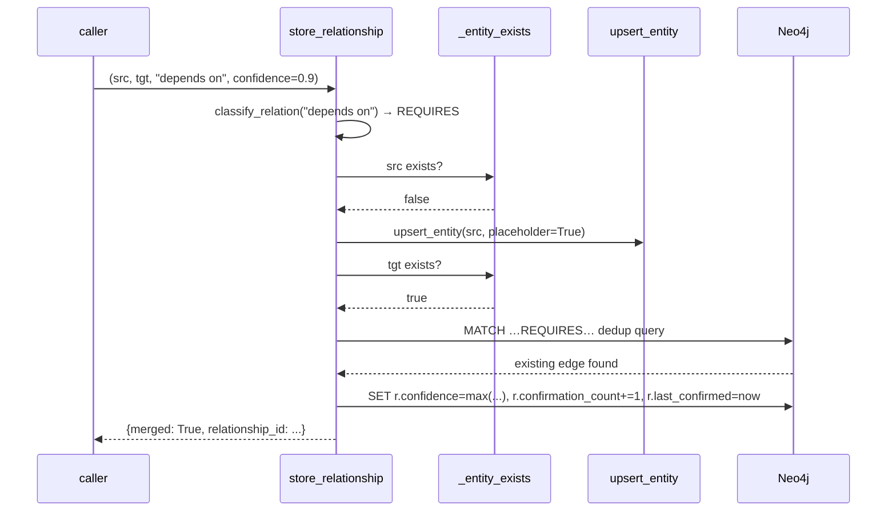

Bulk ingest (`graph_bulk_ingest`) is a thin orchestration layer over all
of this: it entity-upserts in one pass, then relationship-stores in a
second, then stores hierarchies, collecting per-item successes and
failures into a single summary. It is strictly a convenience method —
there is no transactional guarantee that the whole batch either lands or
rolls back. If you need that, you need to compose the lower-level calls
yourself with your own transaction wrapper.

---

## 7. Hybrid retrieval: vector + BM25 fused via RRF

Pure semantic search is good at paraphrase and bad at identifiers. Ask a
vector index for "FastAPI dependency injection" and it will cheerfully
rank a note about generic Python DI frameworks above the one that
literally mentions `FastAPI.Depends`. Full-text search is the opposite:
excellent at identifiers, mediocre at paraphrase. The server fuses the
two so you get both.

Every indexed node type (`Memory`, each typed entity label, `Claim`,
`Document`, `MentalModel`) has both a vector index and a full-text index.
At query time, `recall` (and its graph-layer siblings) does two things in
parallel: it embeds the query and runs `db.index.vector.queryNodes` for
the top-K semantic hits, and it builds a Lucene query via `_escape_lucene`
and runs `db.index.fulltext.queryNodes` for the top-K lexical hits. The
"K" here is `limit × _RETRIEVAL_OVERFETCH` (default multiplier 4) so each
leg has room to contribute distinct candidates before fusion.

Then `_fuse_hits` combines them using **Reciprocal Rank Fusion**:

```
rrf_score(id) = Σ 1 / (k + rank_in_list(id))
                over every list the id appears in
```

with `k = 60` (`_RRF_K`), the standard default from the TREC literature.
Why RRF and not weighted score-mixing? Because the two ranking signals
are on fundamentally different scales — cosine similarity sits in `[0, 1]`
while Lucene BM25 scores are unbounded and query-dependent — and
normalizing them is both annoying and lossy. RRF sidesteps the problem
entirely: it only looks at *rank position*, not raw scores. A document
that ranks #1 in both lists ends up ahead of one that ranks #1 in only
one list, which is the behavior you want.

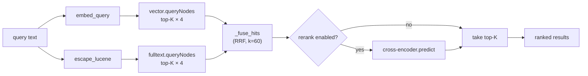

The fused result row carries both original scores (`vector_score`,
`fulltext_score`) *and* the fused `rrf_score`, so a caller inspecting the
response can reason about *why* a hit ranked where it did. A memory that
appears only in the full-text leg will have `vector_score: null` and a
small positive `rrf_score`; one that dominates both legs will have a
high `rrf_score` roughly equal to `1/(k+1) + 1/(k+1) ≈ 0.033`.

Setting `MEMORY_RRF_FUSION=false` disables the full-text leg entirely
and falls back to pure vector search. This exists mainly as an escape
hatch for debugging rank regressions — the hybrid path is the intended
production default.

---

## 8. Reranking with a cross-encoder

RRF fusion produces a strong first-pass ranking, but there is still a
quality ceiling baked into bi-encoder embeddings: the query and candidate
are embedded independently and compared by cosine. A cross-encoder solves
this by taking `(query, candidate)` as a single input and scoring their
relevance jointly, which lets the model attend across both texts and
catch nuanced matches that cosine similarity misses.

The trade-off is latency. The bi-encoder embeds the query once and
compares against a prebuilt index in sub-millisecond ANN time; the
cross-encoder has to run a forward pass per candidate. For a batch of 20
over-fetched hits that's ~20 forward passes, which adds tens of
milliseconds. Reranking is therefore opt-in via `MEMORY_RERANK=true` and
only runs on the overfetched fusion output, never on the raw indexes.

`_rerank_hits` is designed to be fail-soft at every step. If the module
can't import `embeddings.rerank`, if `EMBEDDINGS_ENABLED=false`, if the
query is empty, or if the cross-encoder call itself raises, the function
returns the input list unchanged. The caller never has to catch
reranker-specific errors.

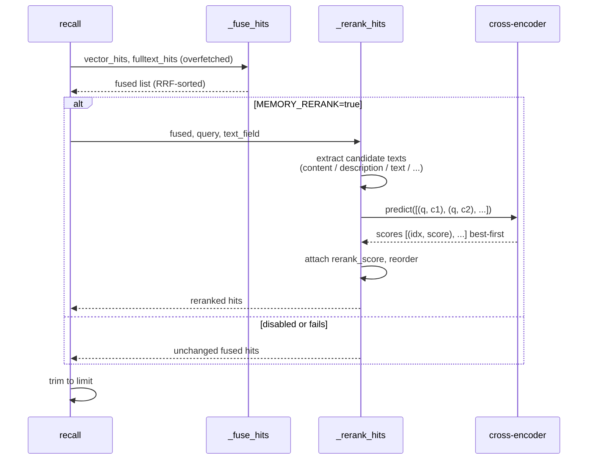

The text-field extraction is adaptive. `_rerank_hits` takes a
`text_field` hint ("content" for memories, "description" for entities,
"text" for claims) but falls back through a chain of plausible fields
before giving up. This is what lets the same helper serve the memory
layer, the entity layer, the claim layer, and the document layer without
each caller having to hand-roll its own extraction.

---

## 9. Claims, auto-contradiction detection, and temporal validity

A `Claim` is an atomic assertion — "FastAPI uses Starlette underneath",
"the rate limit is 100 req/min" — stored as a `:Claim` node with its own
text, embedding, confidence, status, and ASSERTS edges pointing to the
entities it mentions. Claims are the right primitive when a fact might
need to be *verified later* or *disputed by future evidence*.

Each claim carries two temporal fields: `valid_from` (ISO-8601, defaults
to the write time) and `valid_until` (set automatically when the claim
transitions to `retracted` or `disputed`). This separation of "when was
this written down" (`created_at`) from "when is this true in the world"
(`valid_from`) is what powers `graph_claims_as_of`: given a date, return
every claim where `valid_from <= date AND (valid_until IS NULL OR
valid_until > date)`. Time-travel queries over the knowledge graph fall
out of the data model naturally.

### Auto-contradiction detection

The server runs a deterministic contradiction scan on every claim write.
The idea is simple: a new claim about an entity probably contradicts an
existing *supported* claim about the same entity when (a) the two claims
are semantically close and (b) they disagree on polarity.

`_auto_detect_contradictions` implements this. For each entity the new
claim ASSERTS:

1. Pull existing supported claims that ASSERT the same entity (capped at
   25 per entity to bound the cost).
2. For each candidate, compute cosine similarity between the new claim's
   embedding and the candidate's embedding.
3. Reject anything with similarity below `_CONTRADICTION_SIM_THRESHOLD`
   (0.78 — tuned conservatively to prefer missing a borderline conflict
   over inventing spurious ones).
4. For the remaining high-similarity pairs, check **negation polarity**
   using `_has_negation` (regex over "not", "doesn't", "cannot",
   "without", "never"). If one claim is negated and the other isn't, the
   pair is flagged as a contradiction.
5. The server auto-calls `store_contradiction` to create a `CONTRADICTS`
   edge on the entity, and demotes the pre-existing supported claim to
   `disputed` so the next write doesn't retrigger the same alert.

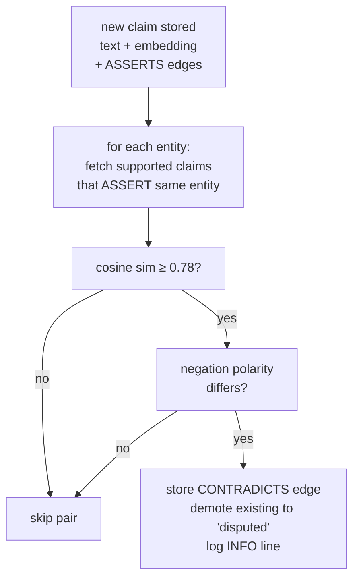

Why is this safe? Because the LLM is not in the loop. The classifier is
regex + cosine, both deterministic, both inspectable. A false positive
costs an extra `CONTRADICTS` edge the user can delete; it doesn't
silently rewrite the graph. And because the pre-existing claim is
demoted to `disputed` rather than retracted, the original assertion is
still readable in the history — just no longer treated as ground truth.

---

## 10. Mental models: cached answers with deterministic staleness

A `MentalModel` is a precomputed answer to a recurring question. Think
of it as a function cache for the agent: "what is the architecture of
project X?" is expensive to re-derive from scratch every session, so the
agent writes the answer once and reads it back on future sessions,
re-deriving only when something underlying has changed.

The node carries a `question`, an `answer`, a `scope` (recommended to
match the `project:<name>` convention used for memory categories), a
`last_refreshed` timestamp, an `access_count`, and a `stale` boolean.
Semantic dedup within a scope means re-calling `graph_set_mental_model`
with a paraphrased question updates the existing MM in place rather than
piling up near-duplicates.

The interesting part is the `(mm)-[:ABOUT]->(Entity)` edges. These wire
the cached answer to the entities it depends on, which is what makes
staleness detection *deterministic* instead of guesswork.
`graph_find_stale_mental_models` runs a single Cypher query that
qualifies an MM as stale when any of four conditions fires:

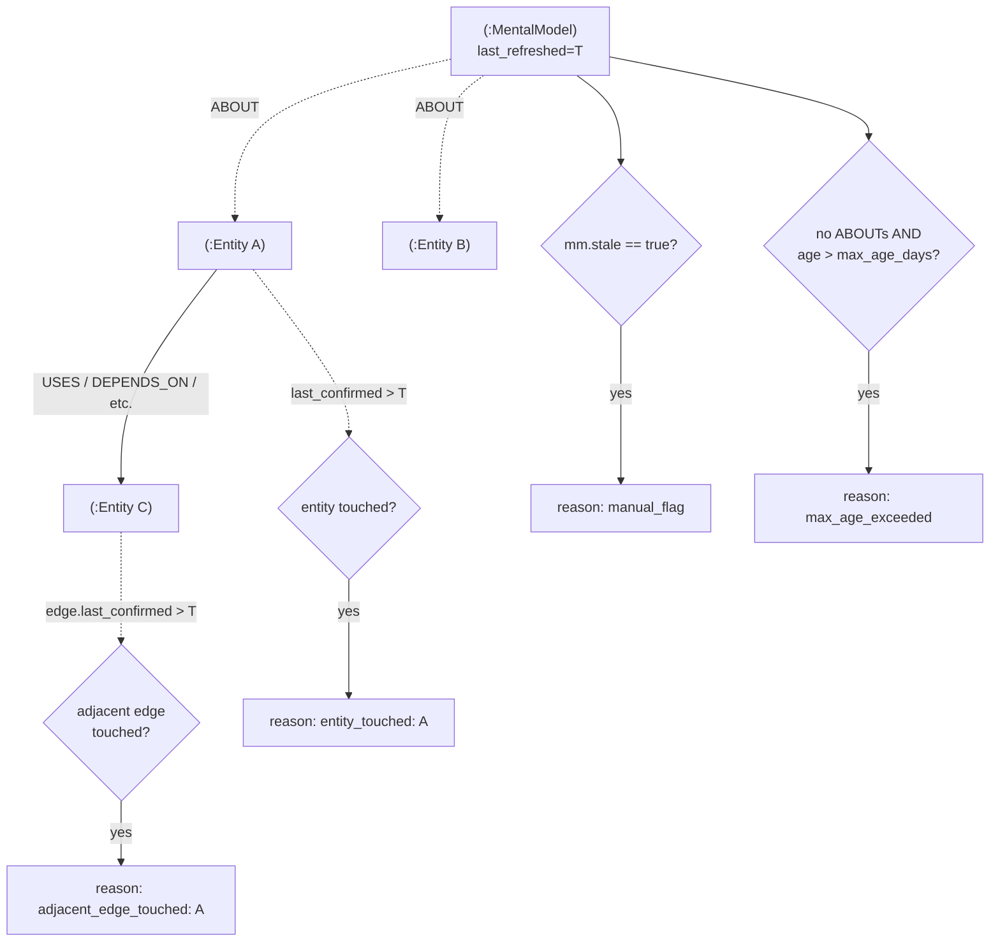

The `max_age_days` branch is a *fallback*. An MM with ABOUT edges trusts
the entity-signal path and ignores raw age — because an unchanged
dependency graph means the cached answer is still valid regardless of
how old it is. Only orphaned MMs (no ABOUT edges) fall back to age-based
expiry.

A critical ergonomics choice: the staleness scan does not call the LLM.
It is pure Cypher, runs server-side, and returns the list of stale MMs
plus their reasons and their `about_entities`. The agent then decides
whether to actually refresh each one (perhaps batching, perhaps
deprioritizing non-critical scopes) and writes the fresh answer back via
`graph_set_mental_model`, which clears the `stale` flag and bumps
`last_refreshed`. The server stays LLM-free; the agent owns refresh
policy.

There's also a split between *observing* and *consuming* an MM.
`graph_find_mental_models` and `graph_get_mental_model` do not bump
`access_count` — they're safe for the refresh scanner to call without
poisoning usage statistics. When the agent actually uses the cached
answer in its response, it calls `graph_touch_mental_model` to record
the cache hit. That separation keeps the hit-rate signal clean.

---

## 11. Communities: lightweight graph summarization

GraphRAG systems typically run a full community-detection algorithm
(Leiden, Louvain) and summarize each cluster with an LLM. This server
takes a lighter approach that stays within the "no LLM in the server
process" rule.

`_detect_clusters` fetches the adjacency over all factual relationship
types, builds an in-memory `Dict[name, Set[name]]`, and runs a greedy
BFS: starting from any unvisited node, grow a cluster by pulling in
neighbors that share at least `_COMMUNITY_MIN_SHARED_RELS` (default 2)
connections with the current cluster. The threshold is what prevents the
BFS from collapsing the entire connected component into one giant
cluster — it enforces local density.

Each cluster then gets passed to `_build_cluster_context`, which
produces a text snippet listing the cluster's entities, their types, and
their most important relationships. That context is stored on a
`:Community` node along with an embedding (so communities themselves are
semantically searchable) and attached to each member entity via a
`MEMBER_OF` edge.

The summarization step is the one place the architecture intentionally
leaves a gap: `_store_community` writes the context verbatim as the
summary. In production you'd pipe this through an LLM to compress and
narrate it, but the server doesn't force that choice — the Community
node stores whatever string you give it, so callers can run the summary
step out-of-band and PATCH it in later.

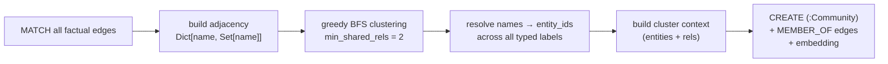

`graph_get_communities` resolves a list of entity ids to the communities
they belong to, which is what `recall_graph_context` uses to inject
cluster-level framing into its retrieval output.

---

## 12. Confidence decay and pruning

The graph is append-mostly: edges and claims accumulate over sessions,
and most of them never get explicitly deleted. Without a background
cleanup, high-noise facts would eventually dominate ranking. Two
cooperating mechanisms handle this.

**`graph_decay_confidence`** walks every factual relationship and
applies exponential decay to `confidence` based on time since
`last_confirmed`:

```
new_confidence = old_confidence * 0.5 ^ (age_days / half_life_days)
```

With the default half-life of 30 days, an edge that was last confirmed
60 days ago retains 25% of its original confidence; at 90 days it's 12.5%.
Every call to `store_relationship` on the same (source, target,
relation) resets `last_confirmed` to now and bumps confidence back up to
`max(existing, new)` — so an edge that keeps getting reconfirmed stays
near 1.0 indefinitely, while one that was asserted once and never
revisited eventually falls below the pruning floor.

**`graph_prune`** sweeps in four passes with a tiered approach to orphans:

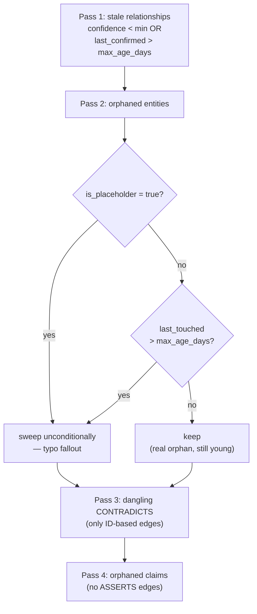

The two-tier orphan sweep is a direct response to a workflow pain point.
If pruning deleted every entity with no edges, an "upsert now, wire up
later" pattern would get eaten by the next scheduled prune. By marking
placeholders explicitly and sweeping them aggressively while giving real
orphans a grace period, the pruner stops punishing good-faith use.

Dry-run mode (`dry_run=True`, the default) runs every COUNT query and
captures up to `sample_size` example items per category, so callers can
preview exactly what would be deleted before committing. The samples
survive into the `dry_run=False` return value too, meaning the
post-delete response describes exactly what was removed.

---

## 13. The `knowledge_check` fast probe

`knowledge_check` is designed to answer one question as cheaply as
possible: *"do I already know anything about X?"* It's the tool an agent
should call first at the start of every session, before doing any
discovery work, so it can orient from existing memory rather than
re-deriving.

The implementation fans the query out across four semantic probes
concurrently using `asyncio.gather` with `return_exceptions=True`:
flat-memory recall, typed-entity search, claim search, and document
search. Running them in parallel means the total latency is bounded by
the slowest leg (typically the entity search, since it hits seven typed
indexes via UNION ALL), not the sum of all four.

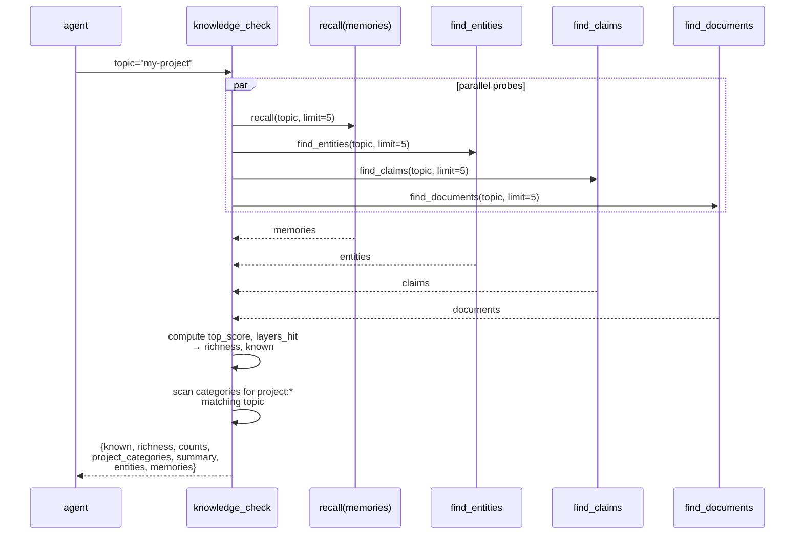

The verdict logic is deliberately conservative. `known` is true when
either the top similarity across all layers clears `min_similarity`
(default 0.4) *or* at least one layer produced any hit at all — the
underlying stores already apply their own thresholds, so a hit means
real signal. `richness` is a coarse `none/low/medium/high` based on how
many layers hit and how strong the top score was. The `summary` field
is a human-readable one-liner so an agent can log or print it directly.

The `project_categories` field is the tactical hint: it scans
`list_categories()` for any `project:*` category whose name contains the
topic, so when an agent probes "payment flow" and gets back
`project_categories: ["project:billing"]`, it knows exactly where to
look next.

---

## 14. Observability: the merge-audit log

Every dedup event — memory merge, entity merge with or without type
upgrade, claim merge — emits a structured log line via `_log_merge`.
These lines all share a common prefix and a stable key=value shape so
they can be grepped out of a mixed log stream and parsed by downstream
tooling:

```
[MERGE] kind=entity id=a3f1... score=0.934 type_upgraded=true
        existing_type=Concept new_type=Technology
        existing="FastAPI" new="FastAPI"
        mention_count=4
```

The `kind` field distinguishes `memory`, `entity`, `claim`, and
`mental_model` merges. `score` is the cosine similarity that triggered
the merge decision. The `existing_preview` and `new_preview` strings are
trimmed to 80 characters so a single merge event stays on one terminal
line even for very long contents.

Auto-contradiction detections also log at INFO level with their own
discriminating prefix (`[KnowledgeGraph] Auto-contradiction flagged:`)
including entity, both claim ids, and the cosine similarity that
triggered the flag. The reasoning is identical: contradictions are
quiet mutations of the graph and the operator deserves a paper trail.

The point is to make the "something magical just happened in the
background" cases *not* magical. A memory that silently dedupes into an
existing one, an entity whose type was quietly upgraded, a supported
claim that got demoted to disputed — all of these leave an audit trail
the operator can scan after the fact.

---

## 15. Fail-soft design

A theme running through the whole module is that *missing optional
infrastructure never raises*. The driver matters because it's the actual
backing store; everything else is best-effort.

Concretely:

- If the Neo4j driver fails to connect in `async_init`, `self._available`
  is set to `False`. Every public method short-circuits on
  `if not self._available: return <empty>` so the server stays alive
  and the agent sees empty results rather than exceptions.
- If `embeddings.py` can't load the model, `EMBEDDINGS_ENABLED` acts as
  if it were set to false. Stores complete without vectors, dedup
  probes are skipped, retrieval falls back to full-text only.
- If the cross-encoder import fails, `_rerank_hits` returns the input
  list unchanged — the fusion result still ranks, just without the
  rerank refinement.
- Every sub-step in `recall_graph_context` (entity seed, relationship
  traversal, community lookup, claim recall, memory recall) is wrapped
  in its own `try/except` that logs and continues. One failing step
  degrades the output by one section rather than dropping the whole
  response.
- Cypher helpers that return node data use `.data()` and tolerate empty
  result sets. The `_unpack_*` helpers all take a possibly-missing node
  dict and return a well-shaped Python dict with sensible defaults.

The one thing that is *not* best-effort is write correctness. If
`store_relationship` can't materialize both endpoints, it refuses to
write the edge rather than let it silently vanish. If `store_claim` can't
embed the text, it still writes the Claim node (without an embedding, so
it won't participate in auto-contradiction scans) rather than dropping
the user's data. The invariant the server tries to hold is simple:
**anything the agent explicitly asked to be remembered either lands in
the database or returns `success: False` with a clear reason**. It never
silently succeeds while losing data.
